# GBN协议实验报告

1120221680

陈思达

## 1. Requirement Analysis

本项目要求使用 UDP 协议实现基于滑动窗口的 Go-Back-N (GBN) 协议，具备可靠文件传输能力。由于 UDP 是不可靠协议，因此需在应用层自行实现超时重传、确认应答、窗口控制等机制，以实现可靠性。

主要功能需求包括：

- 支持滑动窗口机制，窗口大小可配置；
- 支持可变序列号位数及序列号空间管理；
- 基于定时器实现的超时重传；
- 支持配置文件控制：UDP端口、错误率、丢包率、起始序列号、超时时间等参数；
- 发送方与接收方的结构分离，通过结构体和接口封装；
- 实现日志记录功能，记录数据发送与接收过程；
- 实现校验和功能，检测数据包损坏；
- 设计良好的系统初始化逻辑和清理机制。

项目重点：可靠传输的协议逻辑（序列号、超时、确认、窗口滑动）、配置参数解耦设计、调试和错误模拟。

------

## 2. Design

### 2.1 数据帧结构（PDU）

​		位于`proto.h`头文件中。包含 seqNo、length、data、checksum、totalPackets 字段和若干内置函数，介绍如下：

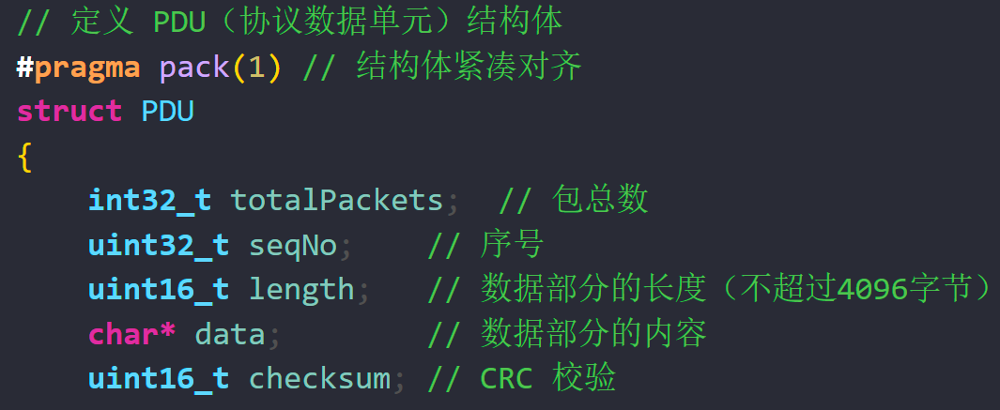


### 2.2 核心机制

- **校验和**：发送时使用伪校验算法生成 checksum；接收端验证是否匹配；
- **滑动窗口**：发送端维护 base 与 nextSeqNum 指针，窗口大小为配置文件指定；
- **序列号空间**：序列号取值范围根据配置的位数决定（如3位支持0~7）；
- **ACK 和重传机制**：
	- 接收方收到任意数据帧后，发送当前对应的 ACK；
	- 发送方维护超时定时器，若未收到 ACK 则超时重传窗口内全部未确认数据；若收到新的ACK，则更新当前窗口位置，继续发送窗口内数据
- **配置文件**：`config.cfg` 中设定各类参数，使用标准 C++ 文件读入模块初始化，修改配置无需反复编译文件
- **日志**：使用标准输出 + 日志文件记录每次数据包的收发及事件；
- **模拟丢包和错误**：在发送端根据丢包率和错误率设定，模拟数据损坏或丢失。

### **2.2 校验和控制**

- 发送方通过CRC算法，在每个数据包装填数据后计算CRC校验码，并赋值到checksum字段
- 接收方通过校验码，判断每个接收包的数据正误

### **2.3 组织组件**

​		代码分为发送端（`sender.exe`)和接收端（`receiver.exe`）

- 发送端：读取文件，按照 dataSize 将文件分割成多个 PDU，装填数据并向接收端发送
- 接收端：校验并识别数据包，向发送端返回ACK确认包


### **2.4 配置文件**

​		代码通过配置文件（`config.cfg`）控制两端应用的行为，修改配置文件会直接影响应用表现，无需重新编译。

- config.cfg 中含有 port，filePath，windowSize，timeout，lostRate，errorRate 等参数
- 通过 loadConfig 读取后传入各功能模块


### **2.5 日志功能**

​		代码实现了发送端和接收端的双端日志功能。每个数据包的发送和接收都会被写入对应日志。日志格式如下：

**发送端日志**：

- 
	- `[2025-05-07 22:18:42]` :时间戳
	- `1`：该数据包的发送次数
	- `pdu_to_send`：该数据包的序号
	- `status`：该数据包的发送状态，NEW/ TO/ RT 对应 初次发送/ 超时重传/ 丢包或错误重传

**接收端日志**：

- 
	- `[2025-05-07 23:00:58]`：时间戳
	- `1`：该数据包的接收次数
	- `pdu_exp`：期望接收的包序号
	- `pdu_recv`：实际接收的包序号
	- `status`：该数据包的接收状态： OK/ NoErr/ DataErr 对应 正确数据包/ 序号错误的包/ 数据错误的包


### 2.6 终端展示

​		代码编写了简易的进度条输出，隐藏了所有其余输出，仅保留`已确认包/ 总包数`的进度条，将所有具体情况输出到日志文件。

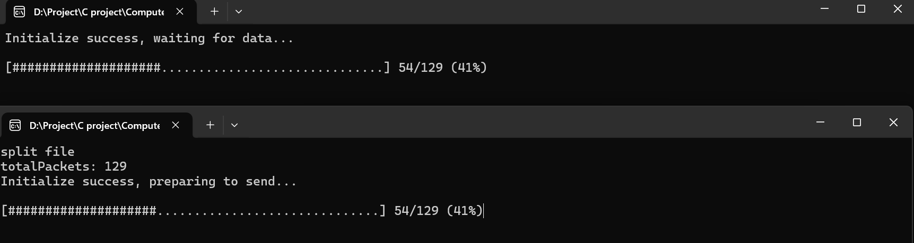


## 3. Development and Implementation

### 3.1 开发环境

- 操作系统：Windows 11
- 编程语言：C++
- 工具链：MinGW / g++、Visual Studio Code
- 网络库：Winsock（Windows）
- 构建方式：头文件（proto.h）、主函数（sender.cpp、receiver.cpp）

### 3.2 项目结构

```plaintext

```

### 3.3 核心代码

#### 进行CRC校验计算

位于`proto.h`，计算当前数据帧的CRC码并赋值给`checksum`字段

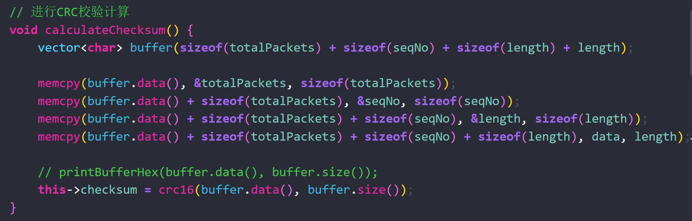


#### 待传输文件切分

```c++
// 读取文件并切分为多个 PDU
vector<PDU> splitFileToPackets(const string &filename, int dataSize, int initSeq, int &totalPackets)
{
    cout << "split file" << endl;
    ifstream file(filename, ios::binary | ios::ate);
    if (!file.is_open())
    {
        cerr << "Failed to open file: " << filename << endl;
        exit(1);
    }

    streamsize fileSize = file.tellg(); // 获取文件大小
    file.seekg(0, ios::beg);            // 回到文件开头

    totalPackets = static_cast<int>(ceil((double)fileSize / dataSize));
    vector<PDU> packets;
    packets.reserve(totalPackets);

    for (int i = initSeq; i < totalPackets + initSeq; ++i)
    {
        int index = i - initSeq;  // 相对索引（0开始）

        // 每个包的大小, 考虑最后一个包需要额外切分
        int thisSize = (index < totalPackets - 1)
        ? dataSize
        : static_cast<int>(fileSize - (totalPackets - 1) * dataSize); 

        PDU pdu;
        pdu.totalPackets = totalPackets; // 设置总包数
        pdu.seqNo = i;
        pdu.length = thisSize;
        pdu.allocateData(thisSize);    // 分配数据空间
        file.read(pdu.data, thisSize); // 读取对应内容
        pdu.calculateChecksum();       // 计算校验和

        packets.push_back(pdu);
    }

    file.close();
    return packets;
}
```


#### 发送端确认与重传机制

发送端初始化参数后，按序发送窗口内的所有数据帧

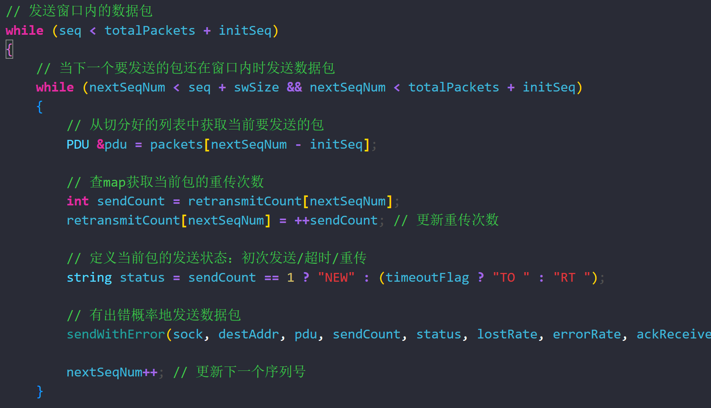


​		在当前窗口内所有数据包发送完毕后，开始阻塞等待ACK。若超时未收到ACK，将当前窗口回退至最近收到的ACK对应序号的数据包处，重新发送数据包。

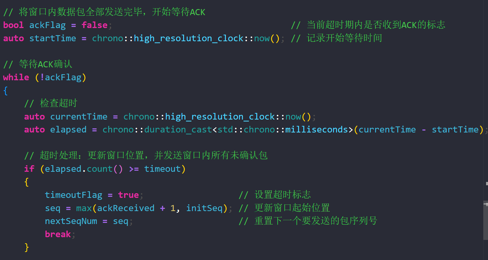


若接收到ACK，更新当前的窗口状态。

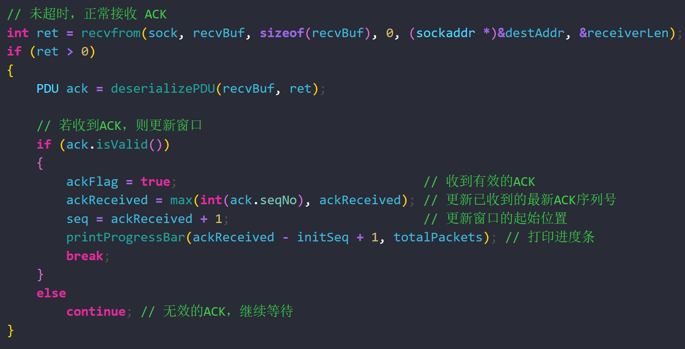


------

## 4. System Deployment, Startup, and Use

1. 修改 `config.cfg` 中参数（UDP端口、文件路径、窗口大小、错误率等），参考配置如下：

  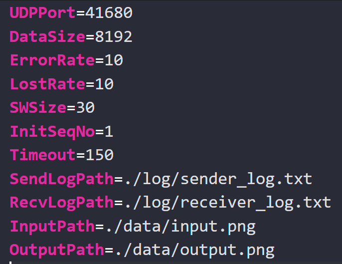

  （注：上图是在传输3.62MB的png文件时的参考配置）

  

2. 编译项目：

	```bash
	cd $dir && chcp 65001 && g++ $fileName -o $fileNameWithoutExt -finput-charset=UTF-8 -fexec-charset=UTF-8 -lpsapi -lkernel32 -lws2_32 && $dir$fileNameWithoutExt
	```

3. 启动接收端：

	```bash
	./receiver.exe
	```

4. 启动发送端：

	```bash
	./sender.exe
	```

5. 等待文件传输完成即可

------

## 5. System Test

### 单元测试

​		编写了`testSender.cpp`，尝试向接收端按序发送了100个自定义的准确无误的数据包。经testSender测试，如下功能已成功实现：

- PDU 序列化与反序列化正确
- 校验和函数通过模拟错误验证

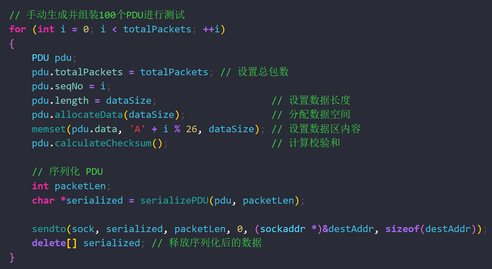


### 集成测试

​		分别使用16KB的txt文件、3.62MB的png文件、9.47MB的pptx文件进行文件传输测试，过程中：

- 正常 ACK 收发，日志完整；
- 设置错误率=0.1、丢包率=0.1，模拟测试能最终完成文件传输。

### 测试截图

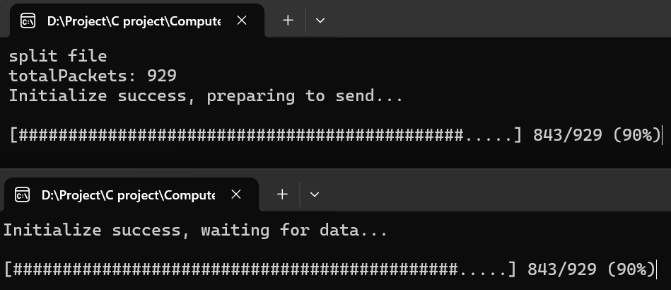

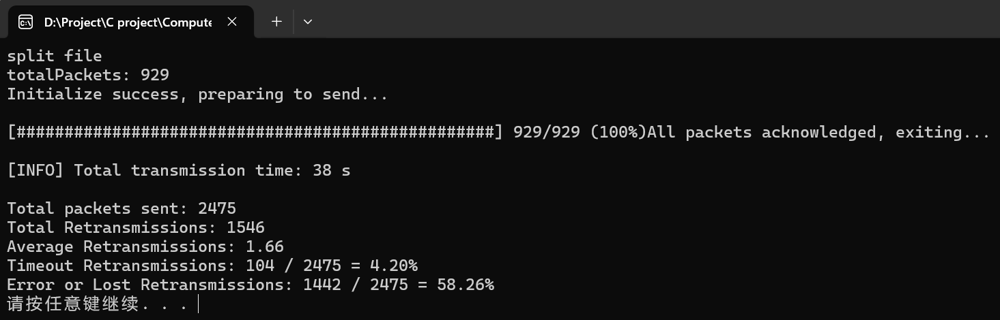

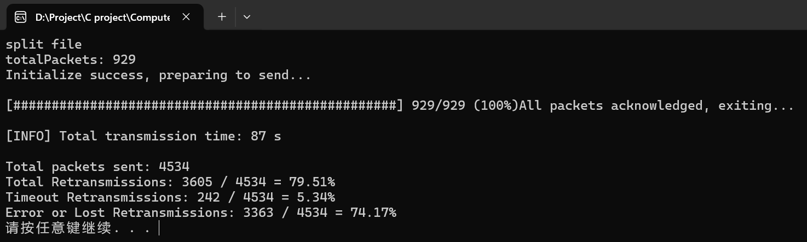


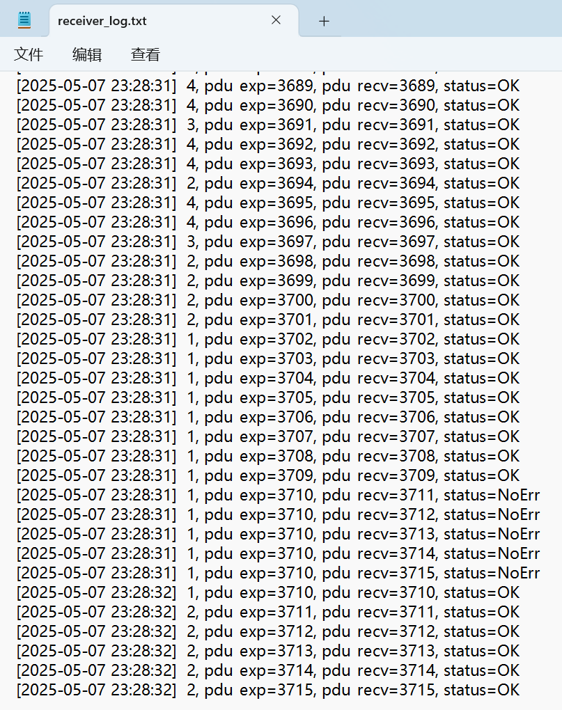

------

## 6. Performance and Analysis

​		为了优化代码性能，实验通过修改配置文件，分析了各种情形下传输同一文件所需的时间，并统计其需要的平均重传次数（包括超时重传和丢包/错包重传），分析结果如下：

| 错误率 | 丢包率 |  包大小   | 窗口大小 | 超时限时 | 平均重传次数 | 耗时 |
| :----: | :----: | :-------: | :------: | :------: | :----------: | ---- |
|  0.05  |  0.05  | 4096 byte |    15    |  300ms   |     1.66     | 38s  |
|  0.1   |  0.1   | 4096 byte |    15    |  300ms   |     4.88     | 87s  |
|  0.1   |  0.1   | 4096byte  |    30    |  300ms   |     7.99     | 92s  |
|  0.05  |  0.05  | 8192 byte |    15    |  300ms   |     2.85     | 30s  |
|  0.1   |  0.1   | 8192 byte |    15    |  300ms   |     5.08     | 53s  |
|  0.1   |  0.1   | 8192byte  |    30    |  300ms   |     8.78     | 46s  |
|  0.1   |  0.1   | 8192byte  |    30    |  150ms   |     8.78     | 25s  |

（上述测试结果基于传输相同的3.62MB的png文件测试）


**部分分析结果截图**：
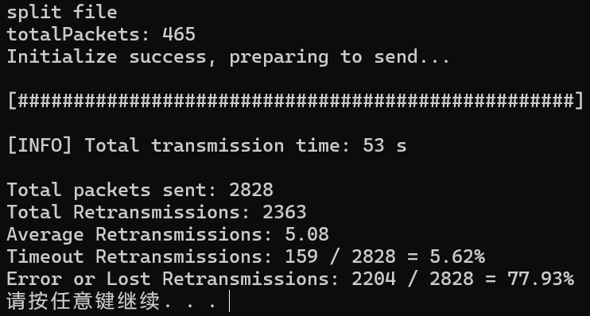

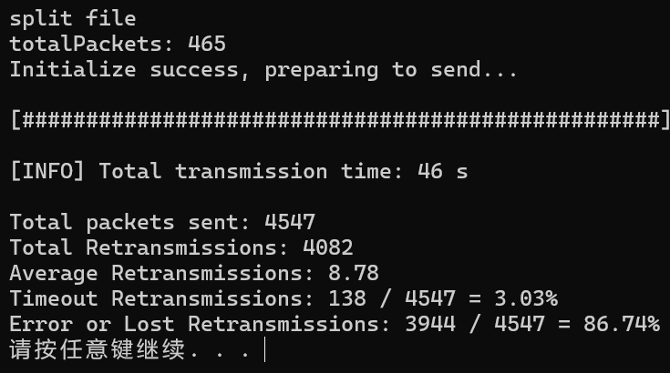

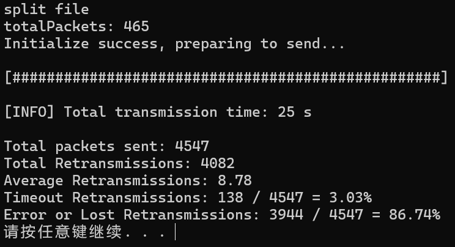


​		**现象分析**

- **随着错误率和丢包率的增加，平均重传次数和传输时长显著增加**。例如，当错误率和丢包率从0.05增加到0.1时，平均重传次数从1.66增加到4.88，传输时长从38s增加到了87s。
- **包大小的增加会导致平均重传次数的增加，但总的传输时间却下降了**。例如，包大小从4096 byte增加到8192 byte时，平均重传次数从1.66增加到2.85，而传输时长从38s降低到了30s。
- **窗口大小的增加会导致平均重传次数的增加，但却不一定影响总的传输时间**。包大小4096byte时，将窗口大小从15增大到30，导致平均重传次数从4.88增长到7.99，传输市场从87s增长到92s。然而，在包大小8192byte时，将窗口从15增大到30，同样导致平均重传次数增大，从5.08增长到8.78，但传输时长从53s缩减到了46s


​		**结论**

- **错误率和丢包率**是影响重传次数和传输时间的主要因素。降低错误率和丢包率可以显著减少重传次数和传输时间。
- **包大小**的增加会增加重传次数，尤其是在网络状况不佳的情况下。
- **窗口大小**的增加可以提高传输效率，减少总传输时间，但在高错误率和丢包率的情况下可能会导致更多的重传和更久的总传输时间。
- **超时限时**的减少可以显著减少传输时间，尤其是在网络状况较好的情况下。

------

## 7. Summary or Conclusions

​		本项目深入理解了 GBN 协议的核心机制，包括窗口管理、超时重传、确认应答及数据帧结构设计等内容。在实践中，我们通过模拟真实网络环境下的丢包、误码情况，验证了该协议的可靠性与健壮性。

​		项目中遇到的关键问题如序列号回绕、超时精度、回退控制等均已解决，最终系统运行稳定，结构清晰，模块职责明确。通过本实验，对面向连接的协议设计、网络编程、协议仿真等能力有显著提升。

------

## 8. References

1. Tanenbaum, A. S., & Wetherall, D. J. (2010). *Computer Networks (5th ed.)*. Pearson.
5. 李新华. *计算机网络教程*. 清华大学出版社.

------

## 9. Comments

​		本课程实践性强，涵盖网络协议从原理到实现的全过程，建议在项目阶段提供更多错误模拟与调试辅助工具示例。此外，可加入 TCP 与 GBN 的对比分析环节，加强理论联系实际的能力。
